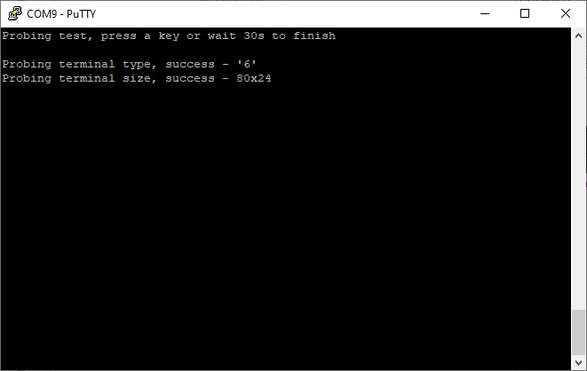
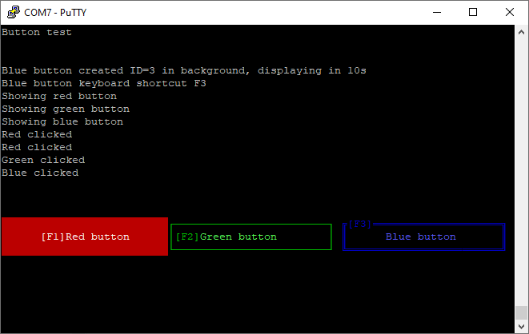
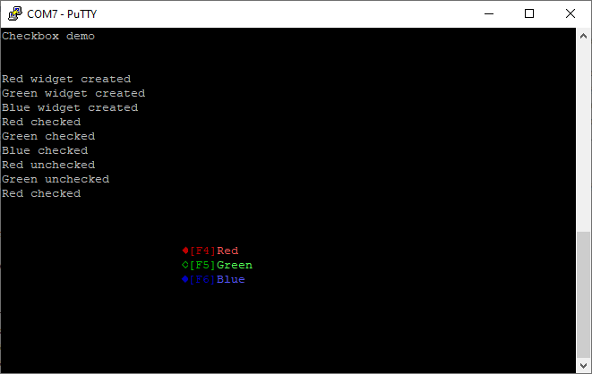
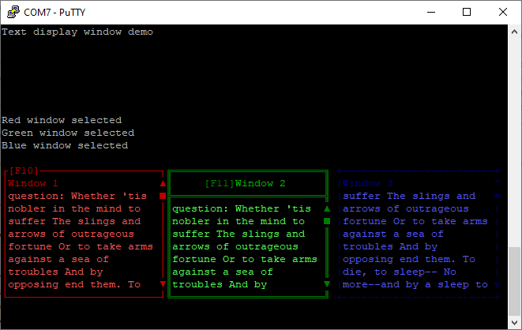
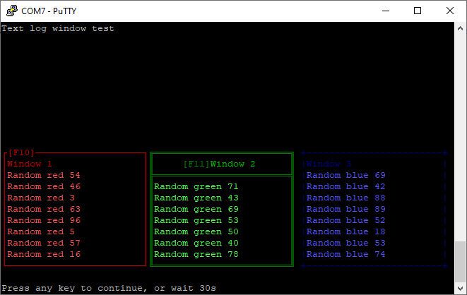
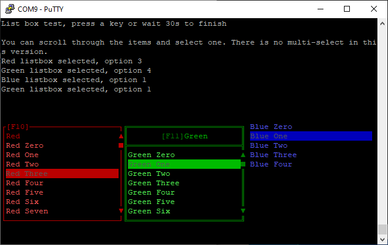
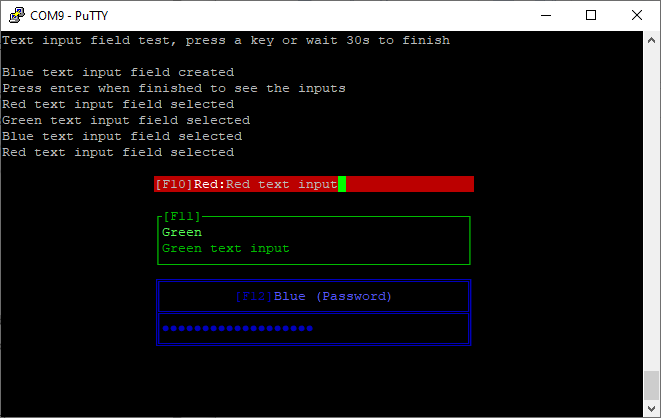

# Widget tests

This sketch checks each type of widget will work in your terminal emulator and on your microcontroller. Run this after you have used the previous example to check basic terminal features.

This sketch is too large to compile on an Arduino Uno, but will compile on an Arduino Mega2560 and most other boards. Testing on an Uno can be done with the smaller examples that test a single type of widget.

## Probing test

This will check the terminal type and size. Press a key when you are done.

## Button test

This will pop up three different buttons, which you should be able to click with the mouse or the shortcut keys F1/F2/F3. Press any other key when you are done.

## Checkbox test

This will show three checkboxes, which you should be able to click with the mouse or shortcut key F4/F5/F6. Press any other key when you are done.

## Radio button test

This will show three radio buttons, which you should be able to click with the mouse or shortcut key F7/F8/F9. Only one radio button can be selected at a time. Press any other key when you are done.

## Text display test

This will show three chunks of Hamlet's soliloquy in separate widgets. You should be able to click with the mouse or shortcut key F10/F11 to select them. Once selected, the mouse scroll wheel should scroll the contents, or you can use the up and down arrows on the keyboard. Press any other key when you are done.

## Text log test

This will display three widgets that slowly add random text. The left and right widget will add text from the bottom, the middle one from the top. Clicking with the mouse or using the shortcut keys F10/F11 will cause a line of text to be added. Press any other key when you are done.

## List box test

This will display three list boxes with many options. You can select a widget with the mouse or shortcut keys You can select one option in each list with the mouse and if the list is too long to fit in the space, scroll it with scroll wheel or arrow keys. Press any other key when you are done.

## Text input test

This will display thee input boxes. Once you have selected one with the mouse or hotkey F10/F11/F12 you can type in the box. The usual edit keys (Home / End / Delete / Backspace / Left / Right). Pressing enter will submit all the entries and show them above. Press any other key when you are done.

