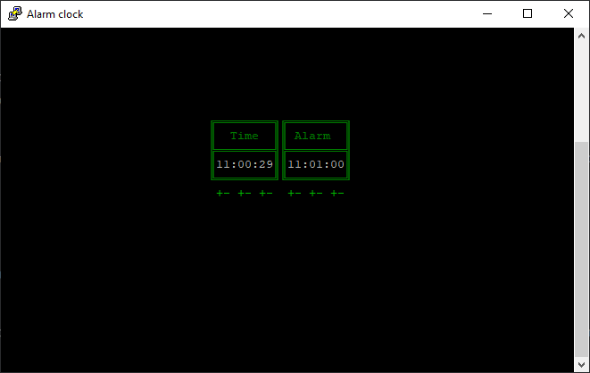
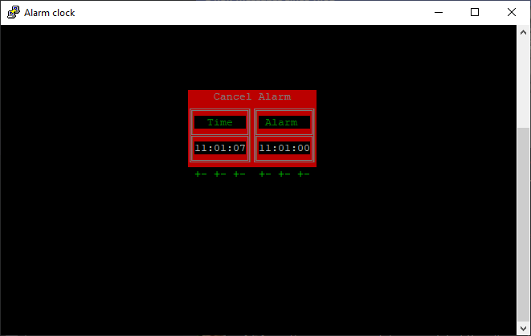

# Alarm clock example

This example is a basic application that implements an 'alarm clock' in the terminal. It's kind of trivial but shows interactivity.

To set the time, use the +/- buttons beneath the clock, likewise with the alarm time.

Once the alarm triggers, the surround of the clock turns red, the 'bell' sounds and you can cancel the alarm by clicking on 'Cancel Alarm'.

