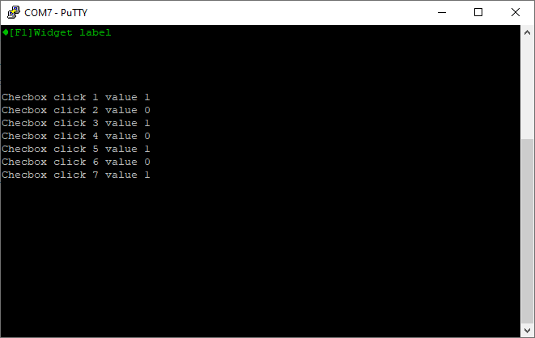

# singleCheckbox.ino

This example sketch shows how to create a single checkbox and register the clicks. As you click the checkbox you should get output like this, which includes a value for its checked/unchecked value.

