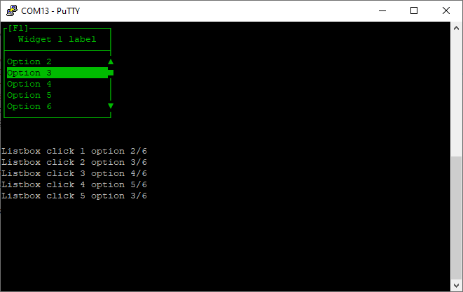

# oneListBoxSixOptions.ino

This widget example places one list box on the terminal.

To select the widget press F1 or select it with the mouse. You can choose options from the list and it should display below.

There are more options than can fit in the list box, you can scroll it with the mouse wheel or by clicking on the top or bottom of the scrollbar.

