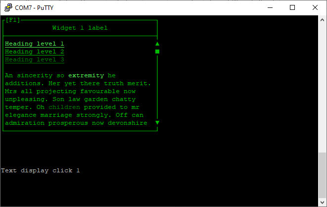

# oneTextDisplay.ino

This widget example places one text display on the terminal.

To select the widget press F1 or select it with the mouse.

The up and down arrow keys, or scroll wheel of the mouse should scroll the content while maintaining word wrap and some basic markdown style formatting of the content. It cannot be edited.

