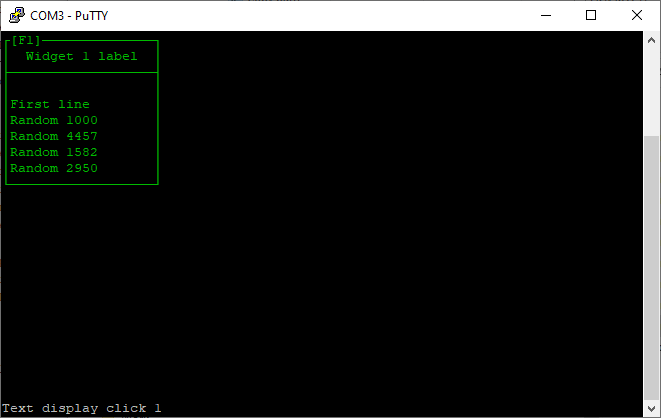

# oneTextLog.ino

This widget example places one text log on the terminal.

To select the widget press F1 or select it with the mouse.

Occasionally the sketch will send a line of text to the widget, like a 'log' or 'chat' window.

This should force the window to scroll the content 'up' while maintaining word wrap and some basic markdown style formatting of the content. It cannot be edited or scrolled with the mouse (yet).

